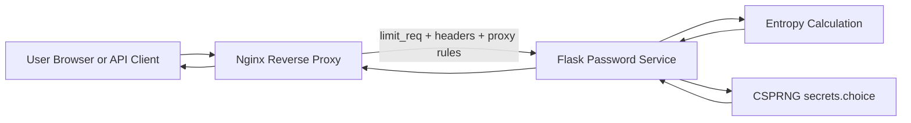
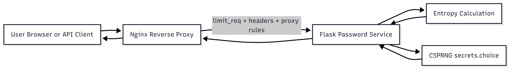

# Secure Password Infrastructure

Professional security-focused mini platform combining:
- a cryptographically secure password generation service;
- an Nginx reverse proxy hardened for request abuse scenarios.

This repository is designed as a practical demonstration of **defense in depth** for web services: secure business logic behind a hardened HTTP perimeter.

## Table of Contents

- [Project Description](#project-description)
- [Problem This Project Solves](#problem-this-project-solves)
- [Architecture Overview](#architecture-overview)
- [Technology Stack](#technology-stack)
- [Repository Structure](#repository-structure)
- [Security Logic and Design Decisions](#security-logic-and-design-decisions)
- [Setup and Run Instructions](#setup-and-run-instructions)
- [API Reference](#api-reference)
- [CLI Reference](#cli-reference)
- [Screenshots and Diagrams](#screenshots-and-diagrams)
- [Troubleshooting](#troubleshooting)
- [Limitations and Production Notes](#limitations-and-production-notes)

---

## Project Description

The project consists of two integrated components:

1. **`password_generator`**: a Flask service that generates high-entropy passwords using a cryptographically secure random source (`secrets`), computes entropy, and exposes both API and UI.
2. **`nginx_proxy`**: an infrastructure layer that fronts the service with request-rate controls and baseline HTTP hardening.

Together, these components illustrate secure application behavior at two levels:
- **Application/data level**: secure secret generation and safe input handling.
- **Infrastructure/perimeter level**: abuse mitigation and reduced information leakage.

---

## Problem This Project Solves

Many password utilities focus only on convenience (quick random strings) but ignore operational security. This project addresses both:

- **Password quality risk**: weak or predictable passwords are vulnerable to brute force.
- **Service availability risk**: unprotected endpoints can be overloaded by request bursts.
- **Configuration disclosure risk**: default server setups expose unnecessary technical details.

This project solves the above by combining:
- CSPRNG-based password generation;
- entropy visibility for user decision-making;
- API input validation and safe failure behavior;
- Nginx-based rate limiting and hardening headers.

---

## Architecture Overview

### High-level flow

1. User accesses web UI or API.
2. Requests hit Nginx (`nginx_proxy`).
3. Nginx applies rate limits and hardening controls.
4. Allowed requests are proxied to Flask (`password_generator`).
5. Flask validates input, generates password, computes entropy, and returns JSON.

### Architecture diagram



### Security boundary model

- **Boundary 1 (Internet/client to proxy):** Nginx handles perimeter controls.
- **Boundary 2 (proxy to app):** only internal service traffic is forwarded.
- **Boundary 3 (app logic):** controlled input and deterministic error handling.

---

## Technology Stack

### Backend

- **Python 3.11+**
- **Flask** (API + server-rendered UI)
- Python standard libraries:
  - `secrets` for CSPRNG;
  - `math` for entropy formula;
  - `argparse` for CLI interface.

### Infrastructure

- **Nginx (alpine image)** as reverse proxy
- **Docker Compose** for multi-service orchestration

### Frontend

- Server-rendered HTML (`Jinja2` via Flask templates)
- Vanilla JavaScript (`fetch`) for API calls
- Custom CSS (no external UI frameworks)

---

## Repository Structure

```text
information_security_projects/
├── README.md
├── password_generator/
│   ├── main.py
│   ├── requirements.txt
│   ├── Dockerfile
│   ├── templates/
│   │   └── index.html
│   └── static/
│       └── css/
│           └── app.css
└── nginx_proxy/
    ├── nginx.conf
    ├── docker-compose.yml
    └── simulate_load.py
```

---

## Security Logic and Design Decisions

### 1) Why `secrets` instead of `random`

- `random` is deterministic and not suitable for security-sensitive token/password generation.
- `secrets` is designed for cryptographic use and relies on secure OS randomness.

### 2) Why entropy is calculated

- Formula: `E = L * log2(R)`
  - `L`: password length
  - `R`: charset size
- Provides a transparent security estimate to users and API consumers.
- Supports objective classification (`Weak`, `Medium`, `Secure`).

### 3) Why strict input validation is enforced

- Length is constrained (`1..256`) to avoid resource abuse.
- Empty charset is rejected to prevent runtime failure and invalid output.
- Invalid input returns controlled `400` responses (no stack traces or undefined behavior).

### 4) Why Nginx rate limiting is used

- `limit_req_zone` and `limit_req` provide a lightweight baseline against request flooding.
- `burst` allows small legitimate spikes while still limiting sustained abuse.

### 5) Why hardening headers are enabled

- `X-Frame-Options: DENY` mitigates clickjacking.
- `X-Content-Type-Options: nosniff` prevents MIME sniffing behavior in browsers.
- `server_tokens off` reduces fingerprinting data.

### 6) Why the architecture is split into two projects

- Keeps concerns isolated:
  - app logic in Flask;
  - perimeter controls in Nginx.
- Easier to maintain, test, and evolve.
- Better reflects production-grade security layering.

---

## Setup and Run Instructions

You can run the platform in two modes:

1. **Local Flask mode** (quick start, no Docker).
2. **Nginx + Docker Compose mode** (full architecture).

### Prerequisites

- Python 3.11 or newer
- `pip`
- Optional: Docker Desktop (for full Nginx + app deployment)

---

### Option A: Local run (Flask only)

#### Step 1: Enter project folder

```powershell
cd D:\information_security_projects\password_generator
```

#### Step 2: Install dependencies

```powershell
pip install -r requirements.txt
```

If needed:

```powershell
pip install flask
```

#### Step 3: Start application

```powershell
python main.py
```

#### Step 4: Open in browser

- UI: `http://127.0.0.1:5000/`
- API example: `http://127.0.0.1:5000/generate?length=16`

#### Step 5: Stop application

Press `Ctrl + C` in the same terminal.

---

### Option B: Full run (Nginx + Flask with Docker Compose)

> Docker must be installed and available in terminal (`docker --version` works).

#### Step 1: Enter proxy folder

```powershell
cd D:\information_security_projects\nginx_proxy
```

#### Step 2: Build and start services

```powershell
docker compose up --build
```

#### Step 3: Access through Nginx

- UI: `http://127.0.0.1/`
- API example: `http://127.0.0.1/generate?length=16`

#### Step 4: Stop and cleanup

Stop running stack:

```powershell
Ctrl + C
```

Cleanup containers/network:

```powershell
docker compose down
```

---

### Optional load simulation (rate-limit demo)

From `nginx_proxy`:

```powershell
python simulate_load.py --url "http://127.0.0.1/generate?length=12" -n 40 -w 20
```

Expected outcome:
- mixture of success responses and rate-limited responses under burst traffic.

---

## API Reference

### Endpoint

- `GET /generate`

### Query parameters

- `length` (integer, required via default fallback): `1..256`
- `no_lower` (optional): disable lowercase set when truthy
- `no_upper` (optional): disable uppercase set when truthy
- `no_digits` (optional): disable digits set when truthy
- `no_symbols` (optional): disable symbols set when truthy

### Example request

```text
/generate?length=20&no_symbols=1
```

### Success response (`200`)

```json
{
  "password": "A_secure_generated_password",
  "entropy": 114.6,
  "status": "Secure"
}
```

### Error responses (`400`)

- `length must be an integer`
- `length must be at least 1`
- `length too large` (includes `max_length`)
- `at least one character set must be enabled`

---

## CLI Reference

### Generate password

```powershell
cd D:\information_security_projects\password_generator
python main.py generate --length 24
```

### Useful flags

- `--no-lower`
- `--no-upper`
- `--no-digits`
- `--no-symbols`

### Example

```powershell
python main.py generate --length 16 --no-symbols
```

CLI output includes:
- generated password;
- length and charset size;
- entropy (bits);
- security status.

---

## Screenshots and Diagrams

### UI screenshot


> Add your captured UI image at `docs/screenshots/web-ui.png`.

### API response screenshot


> Add your captured API response image at `docs/screenshots/api-response.png`.

### Architecture diagram

The Mermaid diagram in this README is the primary architecture diagram.
If you prefer static images (for PDF/slide usage), export and store as `docs/diagrams/architecture.png`.



---

## Troubleshooting

### `docker` command is not recognized

- Install Docker Desktop.
- Restart terminal/IDE.
- Verify:

```powershell
docker --version
```

### Browser cannot open UI

- Ensure server is running.
- For local Flask mode: use `http://127.0.0.1:5000/`.
- For Docker mode: use `http://127.0.0.1/`.

### Port already in use

- Stop existing process/container using that port.
- Restart application stack.

---

## Limitations and Production Notes

- Current Flask server is development-grade; production should use WSGI (Gunicorn/uWSGI equivalent setup).
- TLS/HTTPS termination should be enabled for production deployment.
- Additional production controls are recommended:
  - centralized logging and monitoring;
  - stricter response headers (e.g., CSP);
  - secrets management and CI security checks.

---

## License

This project is currently intended for educational and demonstration purposes.  
Add a formal license file if public/open-source distribution is planned.